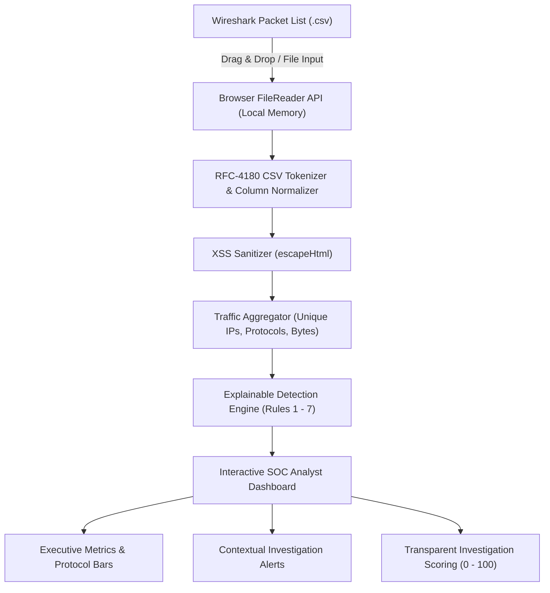

<div align="center">

# 🛡️ Network Traffic Triage Tool (`net-triage`)

**An educational, privacy-first network traffic analysis & anomaly triage laboratory for aspiring SOC analysts.**

[](LICENSE)
[](script.js)
[](index.html)
[](styles.css)
[](#-privacy--architecture-design)
[](#-zero-installation-setup)

[**🌐 Live Demo**](https://deswanth12.github.io/net-triage/) &bull;
[**📖 Analyst Guide**](#-how-to-think-like-a-soc-analyst) &bull;
[**🧪 Sample Scenarios**](#-sample-datasets-included) &bull;
[**🎥 Recruiter Demo Script**](#-step-by-step-recruiter--demo-walkthrough)

</div>

---

## 📌 Project Overview

The **Network Traffic Triage Tool (`net-triage`)** bridges the gap between raw packet captures and actionable security investigations. Built for cybersecurity students and aspiring Security Operations Center (SOC) analysts, it allows users to export packet lists from Wireshark as CSV files and immediately inspect, visualize, and triage them in an intuitive local dashboard.

> [!IMPORTANT]
> **Core Principle of Network Defense:**  
> *"An anomaly is a starting point for investigation, not proof of compromise."*  
> This tool deliberately rejects opaque "99% Malicious Hacker Detected" tropes. Detection heuristics tell defenders **where to look**; methodical investigation determines **what actually happened**.

---

## 🔒 Privacy & Architecture Design



- **100% Client-Side Processing:** All parsing, statistical aggregation, and rule evaluation execute strictly within your local browser's JavaScript engine.
- **Zero Remote Transmission:** Captured packet metadata, IP addresses, payloads, and file contents are **never** transmitted to any server, AI API, analytics vendor, or cloud backend.
- **Zero Dependencies:** Pure vanilla HTML5, CSS3, and JavaScript. No Node.js, Python, Docker, React, Next.js, or external CDN libraries.
- **Zero Tracking:** No cookies, local storage tracking, telemetry pings, or advertisements.

---

## 🚀 Zero-Installation Setup

### Option 1: Run Locally on Windows / Mac / Linux (Offline)
1. Clone or download this repository:
   ```bash
   git clone https://github.com/deswanth12/net-triage.git
   cd net-triage
   ```
2. Double-click **`index.html`** in your file manager, or open it with any web browser (Chrome, Edge, Firefox, Brave, Safari).
3. The dashboard opens instantly ready to ingest captures.

### Option 2: Live Browser Demo
Access the live GitHub Pages deployment at:  
👉 **[https://deswanth12.github.io/net-triage/](https://deswanth12.github.io/net-triage/)**

---

## 🛠️ Wireshark Workflow

1. **Capture Traffic:** Launch Wireshark and capture packets in an authorized network or lab environment.
2. **Stop the Capture:** Halt packet recording once you have gathered the traffic flow.
3. **Export as CSV:**  
   In Wireshark's top menu bar, select:  
   `File > Export Packet Dissections > As CSV...`
4. **Save:** Save the file (e.g., `traffic-capture.csv`).
5. **Analyze:** Drag and drop the CSV directly into the upload area of `net-triage`.

### Tolerant Column Mapping

Wireshark displays column headers based on active preferences. The parser automatically detects common aliases:

| Logical Field | Accepted Column Headings | Required? |
| :--- | :--- | :---: |
| **Source** | `Source`, `Source IP`, `src`, `ip.src`, `Source Address`, `src ip` | **Yes** |
| **Destination** | `Destination`, `Dest`, `dst`, `ip.dst`, `Destination Address`, `dst ip` | **Yes** |
| **Protocol** | `Protocol`, `proto`, `ip.proto` | Recommended |
| **Length** | `Length`, `len`, `frame.len`, `Bytes`, `Packet Length` | Optional |
| **Info** | `Info`, `Information`, `Summary`, `Packet Info` | Recommended (enables port/SYN rules) |
| **Time** | `Time`, `Timestamp`, `frame.time`, `time_relative` | Optional |
| **No.** | `No.`, `No`, `Number`, `frame.number` | Optional |

---

## 🧠 Explainable Detection Rules

Each rule generates an alert card featuring **Observed Evidence**, **Configured Thresholds**, **Why It Matters**, **Possible Benign Explanations**, and **Suggested SOC Investigation Steps**:

| Rule | Default Threshold | Severity | Defensive Context |
| :--- | :---: | :---: | :--- |
| **1. High Packet Volume** | `> 50` packets | Low / Med | Flags high-volume emitters (backups, streaming, scans, or staging). |
| **2. Host Scanning** | `> 10` unique destinations | Medium | Probing many IPs on a subnet (asset discovery vs. ping sweep). |
| **3. Port Scanning** | `> 10` unique ports | Medium | Probing numerous ports on a single host (service discovery vs. scanner). |
| **4. High ICMP Activity** | `> 30` ICMP packets | Low | Subnet ping sweeps, network latency diagnostics, or keepalives. |
| **5. High DNS Query Volume** | `> 30` DNS packets | Low | Rapid domain lookups, heavy browsing, CDN failover, or beaconing. |
| **6. Repeated Conversation** | `> 40` packets | Info | Sustained host-to-host conversation flows (RDP, file copy, active sync). |
| **7. Heavy TCP SYN Bursts** | `> 15` SYN packets | Medium | Half-open connection attempts or connection failures to down services. |

*All thresholds are dynamically configurable in the dashboard settings panel with instant re-analysis.*

---

## 📊 Transparent Investigation Scoring

Rather than an arbitrary percentage, the tool assigns transparent, additive investigative points:

$$\text{Score} = \min\left(100, \sum \text{Rule Points}\right)$$

| Anomaly Indicator | Contributed Points |
| :--- | :---: |
| **Host Scanning** | +25 |
| **Port Scanning** | +25 |
| **High Packet Volume** | +15 to +25 |
| **Heavy TCP SYN Bursts** | +20 |
| **High ICMP Activity** | +15 |
| **High DNS Query Volume** | +15 |
| **Repeated Conversation** | +10 |

- **0–29:** `Baseline Traffic` (Normal expected network operations)
- **30–59:** `Elevated Activity` (Deserves routine analyst triage)
- **60–100:** `Notable Priority` (Deserves structured investigation)

---

## 🧪 Sample Datasets Included

Located in the [`samples/`](samples/) directory (and embedded for one-click instant testing in the UI):

1. [**`samples/normal-traffic.csv`**](samples/normal-traffic.csv): Clean workstation baseline (DNS queries, TLS 1.3 handshakes, NTP sync, ARP requests). Produces **0 alerts** and an Investigation Score of **0**.
2. [**`samples/high-volume-traffic.csv`**](samples/high-volume-traffic.csv): Workstation `192.168.1.55` uploading a backup file. Triggers **Rule 1 (High Packet Volume)**.
3. [**`samples/mixed-soc-lab.csv`**](samples/mixed-soc-lab.csv): Multi-stage scenario with a 33-host ICMP sweep, a 14-port TCP scan against an internal server, and high-volume sustained conversations. Triggers **Rules 1, 2, 3, 4, and 6** (Score: 90).

---

## 🎥 Step-by-Step Recruiter & Demo Walkthrough

When presenting this project during technical interviews or recording a portfolio video:

1. **Scene 1: Baseline Traffic (No Alert Fatigue)**
   - Click **Normal Baseline**. Notice: Score is `0`, alert count is `0`.
   - *Key Talking Point:* "A well-tuned SOC tool should establish a quiet baseline during ordinary user operations to prevent alert fatigue."
2. **Scene 2: High Packet Volume (Non-Accusatory Triage)**
   - Click **High Packet Volume**. Host `192.168.1.55` generates 60+ packets and triggers Rule 1.
   - *Key Talking Point:* "Notice the alert does not claim this machine was hacked. It presents legitimate benign reasons—like an OS patch or file transfer—alongside concrete investigation steps."
3. **Scene 3: Mixed SOC Lab (Multi-Vector Triage)**
   - Click **Mixed SOC Lab**. Five alerts trigger; Score jumps to `90 (Notable Priority)`.
   - Filter the packet preview by typing `192.168.1.99` to visually confirm the ICMP echo requests and sequential SYN probes.
4. **Scene 4: Dynamic Threshold Tuning**
   - Expand the **Detection Threshold Settings** panel, adjust **Unique Destinations** from `10` to `40`, and click **Apply Thresholds**.
   - *Key Talking Point:* "Thresholds are environmental. In a data center, an active proxy talking to 40 hosts is normal; on a reception desk PC, it warrants immediate escalation."

---

## 🧭 How to Think Like a SOC Analyst

1. **Observe Unusual Behaviour:** Spot anomalous volume, strange protocol distributions, or unexpected host conversations.
2. **Identify Source and Destination:** Pinpoint the IP addresses. Are they internal workstations, server subnets, or external internet IPs?
3. **Determine Protocol & Port:** Is the traffic standard DNS/HTTPS, or uncommon raw TCP?
4. **Establish Expectation:** Check asset management. Is the device an authorized vulnerability scanner or domain controller?
5. **Look for Supporting Indicators:** Check timestamps, repetition intervals, and error flags (RST, ICMP Unreachable).
6. **Correlate with Security Telemetry:** Cross-reference endpoint EDR/Sysmon telemetry and firewall logs.
7. **Decide Next Action:** Close as authorized benign activity or escalate to incident response.

---

## ⚠️ Limitations (Documented for Students)

- **Metadata Only:** CSV packet lists contain summary columns. They do not contain raw binary payloads, so deep packet inspection or malware carving cannot be performed.
- **NAT Obfuscation:** Multiple internal hosts behind a NAT router share one public IP address, artificially inflating its packet count.
- **Wireshark Profile Dependency:** Port and TCP flag detection rely on Wireshark's default `Info` column formatting.
- **Environment Variance:** Packet thresholds are educational defaults and must always be calibrated to the specific network environment.

---

## 📄 License & Author

- **Author:** [Deswanth](https://github.com/deswanth12)
- **License:** Released under the [MIT License](LICENSE).
