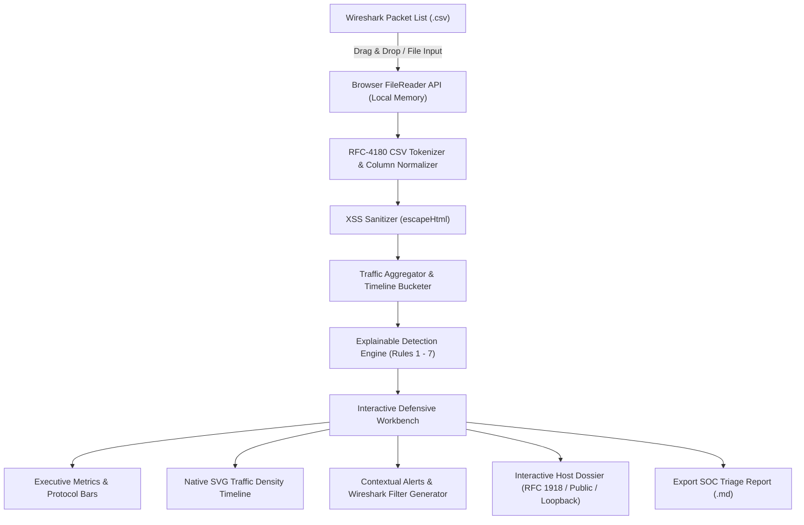

<div align="center">

# 🛡️ Network Traffic Triage Tool (`net-triage`)

**An educational, privacy-first defensive network-investigation workbench for aspiring SOC analysts.**

[](LICENSE)
[](script.js)
[](index.html)
[](styles.css)
[](#-automated-testing)
[](#-privacy--architecture-design)
[](#-zero-installation-setup)

[**🌐 Live Demo**](https://deswanth12.github.io/net-triage/) &bull;
[**📖 Analyst Guide**](#-how-to-think-like-a-soc-analyst) &bull;
[**🧪 Sample Scenarios**](#-sample-datasets-included) &bull;
[**🎥 Recruiter Demo Script**](#-10-step-recruiter--demo-walkthrough)

</div>

---

## 📌 Project Overview

The **Network Traffic Triage Tool (`net-triage`)** is a browser-based defensive network-investigation workbench designed to bridge the gap between raw Wireshark packet captures and methodical SOC investigations.

It allows students and defenders to export packet lists from Wireshark as CSV files and instantly inspect, visualize, triage, and document anomalous traffic patterns—all locally inside the browser.

> [!IMPORTANT]
> **Core Principle of Network Defense:**  
> *"An anomaly is a starting point for investigation, not proof of compromise."*  
> This workbench deliberately rejects opaque "99% Malicious Hacker Detected" hype. Detection heuristics tell defenders **where to look**; methodical investigation determines **what actually happened**.

---

## 🔒 Privacy & Architecture Design



- **100% Client-Side Processing:** All parsing, statistical aggregation, timeline rendering, and rule evaluation execute strictly within your local browser's JavaScript engine.
- **Zero Remote Transmission:** Captured packet metadata, IP addresses, payloads, and file contents are **never** transmitted to any server, AI API, analytics vendor, or cloud backend.
- **Zero Dependencies:** Pure vanilla HTML5, CSS3, and JavaScript. No Node backend, no Python server, no Docker, no React, no Next.js, and no external CDN libraries.
- **Zero Tracking:** No cookies, local storage tracking, telemetry pings, or advertisements.

---

## 🚀 Zero-Installation Setup

### Option 1: Run Locally on Windows / Mac / Linux (Offline)
1. Clone or download this repository:
   ```bash
   git clone https://github.com/deswanth12/net-triage.git
   cd net-triage
   ```
2. Double-click **`index.html`** in your file manager, or open it with any web browser (Chrome, Edge, Firefox, Brave, Safari).
3. The dashboard opens instantly ready to ingest captures.

### Option 2: Live Browser Demo
Access the live GitHub Pages deployment at:  
👉 **[https://deswanth12.github.io/net-triage/](https://deswanth12.github.io/net-triage/)**

---

## ⚡ Core Defensive Workbench Features

### 1. 📝 Export SOC Triage Incident Report (Markdown)
* **What it does:** Real SOC analysts document their triage in ticketing systems (Jira, ServiceNow, TheHive). Clicking **"Export Triage Report (.md)"** instantly compiles and downloads a structured Markdown incident report.
* **Report Contents:**
  - Executive capture metadata (filename, packet counts, time window, demo status)
  - Triage score (0–100) and severity classification
  - Full findings table (Rule ID, Severity, Source, Destination, Evidence, Threshold)
  - Full investigative context (Why it matters, Benign explanations, Recommended steps)
  - Contextual Wireshark filters for escalated review
  - Recommended Tier-2 incident response next actions
  - Mandatory educational and authorization disclaimers
* **Safety:** Generated 100% client-side as a `Blob` download with strict serialization of untrusted CSV values.

### 2. 🔍 Contextual Wireshark Display Filter Generator
* **What it does:** Every alert includes a **"Copy Filter"** button providing the exact Wireshark display filter to jump straight into raw packet inspection:
  - **High-Volume Source:** `ip.addr == <SOURCE_IP>`
  - **Host-to-Host Flow:** `ip.src == <SOURCE_IP> && ip.dst == <DESTINATION_IP>`
  - **ICMP Sweep:** `ip.src == <SOURCE_IP> && icmp`
  - **TCP SYN Burst:** `ip.src == <SOURCE_IP> && tcp.flags.syn == 1`
  - **Port Scan:** `ip.src == <SOURCE_IP> && ip.dst == <DESTINATION_IP> && tcp.flags.syn == 1`
* **Integrity:** Generated strictly from observed evidence. If required packet fields are absent, explicitly displays: *"Wireshark filter unavailable because the required packet fields were not present in this CSV."*

### 3. 🎯 Interactive Host Intelligence Dossier
* **What it does:** Clicking any IP address anywhere in the workbench (Top Sources, Top Destinations, Conversations, Packet Preview, or Alerts) opens a deep **Host Dossier** modal.
* **Dossier Metrics:**
  - **Local IP Classification:** Auto-categorizes as `Private RFC 1918` (`10.x`, `172.16-31.x`, `192.168.x`), `Loopback`, `Link-local`, `Multicast`, `Broadcast`, `Public/WAN`, or `Unknown`.
  - **Activity Profile:** Sent vs. received packet count, unique destinations contacted, unique senders, average packet size, and top protocol.
  - **Communication Top Talkers:** Top 5 contacted destinations and top 5 inbound sources.
  - **Triggered Findings:** All triage alerts involving this specific host with direct evidence links.
  - **Zero External APIs:** 100% computed from in-memory CSV data. Zero GeoIP lookups.

### 4. 📈 Traffic Density Timeline (Native SVG)
* **What it does:** Parses relative seconds or timestamps and divides the capture into uniform time buckets to render a responsive, browser-native SVG histogram.
* **Analytical Limitation Note:**  
  *"Traffic density can provide useful investigative context, but a spike alone does not establish malicious activity."*
* **Resilience:** If timestamps are missing or unparseable, gracefully displays: *"Traffic timeline unavailable because usable packet timestamps were not found."* Zero fabricated data.

---

## 🛠️ Wireshark Workflow

1. **Capture Traffic:** Launch Wireshark and capture packets in an authorized network or lab environment.
2. **Stop the Capture:** Halt packet recording once you have gathered the traffic flow.
3. **Export as CSV:**  
   In Wireshark's top menu bar, select:  
   `File > Export Packet Dissections > As CSV...`
4. **Save:** Save the file (e.g., `traffic-capture.csv`).
5. **Analyze:** Drag and drop the CSV directly into the upload area of `net-triage`.

### Tolerant Column Mapping

Wireshark displays column headers based on active preferences. The parser automatically detects common aliases:

| Logical Field | Accepted Column Headings | Required? |
| :--- | :--- | :---: |
| **Source** | `Source`, `Source IP`, `src`, `ip.src`, `Source Address`, `src ip` | **Yes** |
| **Destination** | `Destination`, `Dest`, `dst`, `ip.dst`, `Destination Address`, `dst ip` | **Yes** |
| **Protocol** | `Protocol`, `proto`, `ip.proto` | Recommended |
| **Length** | `Length`, `len`, `frame.len`, `Bytes`, `Packet Length` | Optional |
| **Info** | `Info`, `Information`, `Summary`, `Packet Info` | Recommended (enables port/SYN rules) |
| **Time** | `Time`, `Timestamp`, `frame.time`, `time_relative` | Optional (enables timeline) |
| **No.** | `No.`, `No`, `Number`, `frame.number` | Optional |

---

## 🧠 Explainable Detection Rules

Each rule generates an alert card featuring **Observed Evidence**, **Configured Thresholds**, **Why It Matters**, **Possible Benign Explanations**, and **Suggested SOC Investigation Steps**:

| Rule | Default Threshold | Severity | Defensive Context |
| :--- | :---: | :---: | :--- |
| **1. High Packet Volume** | `> 50` packets | Low / Med | Flags high-volume emitters (backups, streaming, scans, or staging). |
| **2. Host Scanning** | `> 10` unique destinations | Medium | Probing many IPs on a subnet (asset discovery vs. ping sweep). |
| **3. Port Scanning** | `> 10` unique ports | Medium | Probing numerous ports on a single host (service discovery vs. scanner). |
| **4. High ICMP Activity** | `> 30` ICMP packets | Low | Subnet ping sweeps, network latency diagnostics, or keepalives. |
| **5. High DNS Query Volume** | `> 30` DNS packets | Low | Rapid domain lookups, heavy browsing, CDN failover, or beaconing. |
| **6. Repeated Conversation** | `> 40` packets | Info | Sustained host-to-host conversation flows (RDP, file copy, active sync). |
| **7. Heavy TCP SYN Bursts** | `> 15` SYN packets | Medium | Half-open connection attempts or connection failures to down services. |

*All thresholds are dynamically configurable in the dashboard settings panel with instant re-analysis.*

---

## 📊 Transparent Investigation Scoring

Rather than an arbitrary percentage, the tool assigns transparent, additive investigative points:

$$\text{Score} = \min\left(100, \sum \text{Rule Points}\right)$$

| Anomaly Indicator | Contributed Points |
| :--- | :---: |
| **Host Scanning** | +25 |
| **Port Scanning** | +25 |
| **High Packet Volume** | +15 to +25 |
| **Heavy TCP SYN Bursts** | +20 |
| **High ICMP Activity** | +15 |
| **High DNS Query Volume** | +15 |
| **Repeated Conversation** | +10 |

- **0–29:** `Baseline Traffic` (Normal expected network operations)
- **30–59:** `Elevated Activity` (Deserves routine analyst triage)
- **60–100:** `Notable Priority` (Deserves structured investigation)

---

## 🧪 Sample Datasets Included

Located in the [`samples/`](samples/) directory (and embedded for one-click instant testing in the UI):

1. [**`samples/normal-traffic.csv`**](samples/normal-traffic.csv): Clean workstation baseline (DNS queries, TLS 1.3 handshakes, NTP sync, ARP requests). Produces **0 alerts** and an Investigation Score of **0**.
2. [**`samples/high-volume-traffic.csv`**](samples/high-volume-traffic.csv): Workstation `192.168.1.55` uploading a backup file. Triggers **Rule 1 (High Packet Volume)**.
3. [**`samples/mixed-soc-lab.csv`**](samples/mixed-soc-lab.csv): Multi-stage scenario with a 33-host ICMP sweep, a 14-port TCP scan against an internal server, and high-volume sustained conversations. Triggers **Rules 1, 2, 3, 4, and 6** (Score: 90).

---

## 🎥 10-Step Recruiter & Demo Walkthrough

Follow this scripted 10-step sequence when demonstrating the project to recruiters or recording a walkthrough video:

1. **Load Normal Traffic:** Click **Normal Baseline** under Instant Demo Scenarios.
2. **Show the Clean Baseline:** Highlight that the Investigation Score is `0` and `0 Findings` were triggered, demonstrating that well-tuned SOC rules prevent alert fatigue.
3. **Load Mixed SOC Lab Data:** Click **Mixed SOC Lab**. Point out the jump to Score `90 (Notable Priority)` and 5 distinct alerts.
4. **Open an Alert:** Review the **Possible Network Host Scanning** finding, demonstrating the structured evidence and threshold comparison.
5. **Copy the Generated Wireshark Filter:** Click **Copy Filter** (`ip.src == 192.168.1.99`) and observe the temporary green *"Filter copied."* feedback.
6. **Open the Source IP Host Dossier:** Click the blue interactive IP pill `192.168.1.99`.
7. **Review Communication Profile:** Inspect its `Private RFC 1918` categorization, 34 unique destinations contacted, and triggered rule findings. Close the dossier.
8. **Inspect the Traffic Timeline:** Scroll to the SVG histogram and explain how the capture's time buckets illustrate sudden traffic bursts.
9. **Export the SOC Triage Report:** Click **Export Triage Report (.md)** in the action bar to download the structured incident documentation.
10. **State the Educational Takeaway:** Conclude with the central thesis:  
    *"Detection tells an analyst where to look; investigation determines what actually happened. An anomaly is a starting point for investigation, not proof of compromise."*

---

## 🧭 How to Think Like a SOC Analyst

1. **Observe Unusual Behaviour:** Spot anomalous volume, strange protocol distributions, or unexpected host conversations.
2. **Identify Source and Destination:** Pinpoint the IP addresses. Are they internal workstations, server subnets, or external internet IPs?
3. **Determine Protocol & Port:** Is the traffic standard DNS/HTTPS, or uncommon raw TCP?
4. **Establish Expectation:** Check asset management. Is the device an authorized vulnerability scanner or domain controller?
5. **Look for Supporting Indicators:** Check timestamps, repetition intervals, and error flags (RST, ICMP Unreachable).
6. **Correlate with Security Telemetry:** Cross-reference endpoint EDR/Sysmon telemetry and firewall logs.
7. **Decide Next Action:** Close as authorized benign activity or escalate to incident response.

---

## 🧪 Automated Testing

The workbench includes a 15-point automated test suite verifying parsing, boundary math, filter generation, local IP categorization, and security sanitization:

```bash
node test-suite.js
```

### Verified Test Suite Criteria:
- [x] Test 1: Markdown report generates valid heading structure.
- [x] Test 2: Report with 0 alerts includes explicit clean baseline section.
- [x] Test 3: Report with multiple alerts documents each finding systematically.
- [x] Test 4: Markdown safely formats untrusted text without breaking document structure.
- [x] Test 5: Port scan alert produces precise Wireshark display filter.
- [x] Test 6: Non-IP or missing field alert safely sets wiresharkFilter to null (triggering fallback).
- [x] Test 7: Host dossier correctly compiles sent/received, unique host counts, and byte averages.
- [x] Test 8: Private RFC 1918 addresses (`10.x`, `172.16-31.x`, `192.168.x`) correctly classified.
- [x] Test 9: IPv4 and IPv6 loopback addresses correctly classified.
- [x] Test 10: Public/WAN routable IP addresses correctly classified.
- [x] Test 11: Valid timestamps compute span and bucket divisions accurately.
- [x] Test 12: Missing timestamps yield 0 valid times, triggering graceful fallback message.
- [x] Test 13: Malformed timestamps fail safely without throwing unhandled exceptions.
- [x] Test 14: Threshold boundary strictly evaluates `>` (50 does not trigger, 51 triggers).
- [x] Test 15: All 3 sample datasets trigger expected alerts under upgraded engine.

---

## ⚠️ Analytical Limitations & Performance

- **Metadata Only:** CSV packet lists contain summary columns. They do not contain raw binary payloads, so deep packet inspection or malware carving cannot be performed.
- **NAT Obfuscation:** Multiple internal hosts behind a NAT router share one public IP address, artificially inflating its packet count.
- **Wireshark Profile Dependency:** Port and TCP flag detection rely on Wireshark's default `Info` column formatting.
- **Environment Variance:** Packet thresholds are educational defaults and must always be calibrated to the specific network environment.
- **Performance Envelope:** Tested and optimized for standard Wireshark CSV exports (up to ~50,000 packets). Preview tables display the first 100 matching rows to maintain instant UI responsiveness.

---

## 📄 License & Author

- **Author:** [Deswanth](https://github.com/deswanth12)
- **License:** Released under the [MIT License](LICENSE).
