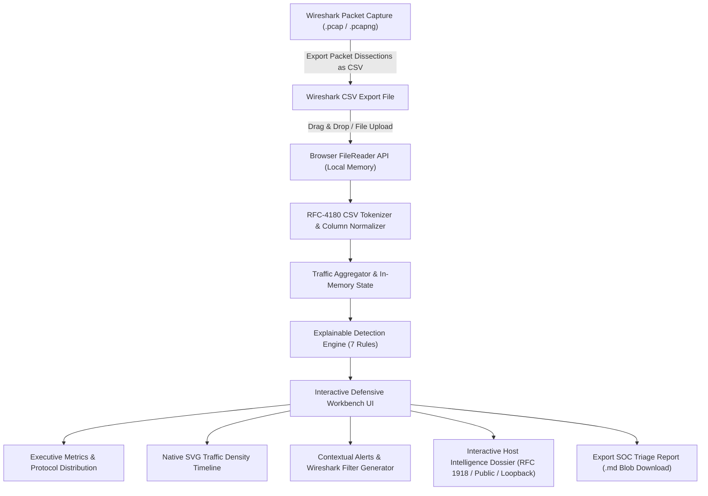
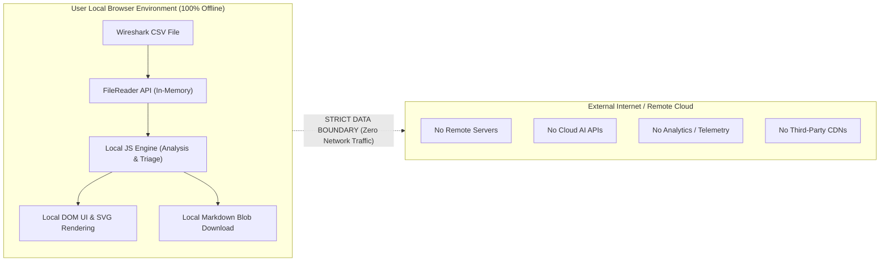

# 🛡️ Network Traffic Triage Tool (`net-triage`)

A privacy-first, browser-based network traffic triage workbench that analyses Wireshark CSV exports locally and helps defenders identify network activity worth investigating.

[](LICENSE)
[](script.js)
[](index.html)
[](styles.css)
[](#-automated-testing)
[](#-privacy-architecture)
[](#-technology-stack)

[**🌐 Live Demo**](https://deswanth12.github.io/net-triage/) &bull; [**📖 Analyst Methodology**](#-educational-value-thinking-like-a-soc-analyst) &bull; [**🧪 Sample Datasets**](#-demonstration-scenarios) &bull; [**🛠️ Wireshark Export Guide**](#-how-to-use-wireshark-export-guide)

---

## 📌 Overview

The **Network Traffic Triage Tool (`net-triage`)** is a browser-based defensive network-investigation workbench designed to bridge the gap between raw packet captures in Wireshark and structured, explainable security triage in a Security Operations Center (SOC).

It allows aspiring security analysts, system administrators, and cybersecurity students to export packet lists from Wireshark as CSV files and immediately inspect, visualize, triage, and document anomalous traffic patterns—all executed 100% locally inside the browser.

> [!IMPORTANT]
> **Core Principle of Network Defense:**  
> *"An anomaly is a starting point for investigation, not proof of compromise."*  
> This workbench intentionally avoids opaque "black-box" detection claims or arbitrary certainty scores. Detection heuristics indicate **where to look**; methodical analyst investigation determines **what actually occurred**.

---

## 💡 Why I Built This

- **The Theory-to-Practice Gap:** Many cybersecurity courses teach packet theory (three-way handshakes, ICMP types, DNS queries) and introduce Wireshark. However, beginners often struggle when transitioning from isolated packet inspection to triaging captures with tens of thousands of frames.
- **Wireshark Can Be Overwhelming:** Wireshark is an exceptional deep packet inspection tool, but opening a capture without knowing what to filter for can feel daunting. Beginners need a structured triage layer to spotlight high-volume emitters, scanning behaviors, and conversation patterns before drilling down into raw packets.
- **The "Black Box" Problem in Modern Security:** Many modern commercial security products provide automated risk scores or alert labels without showing the underlying arithmetic or reasoning. This tool was built to provide complete transparency: every alert explains its trigger threshold, observed evidence, benign explanations, and suggested next steps.
- **Privacy and Portability:** Network packet metadata often contains sensitive internal hostnames, corporate IP addresses, and user activity. Ingesting this data into cloud-hosted tools or third-party AI APIs can violate data protection policies. This project guarantees zero remote data exposure by executing entirely in client-side memory.

---

## 🔄 Core Workflow

The workbench follows an analyst-centric data flow from raw packet ingestion to structured incident reporting:



---

## ✨ Key Features

- **100% Local Browser Parsing:** Zero remote server transmission. Ingests and processes Wireshark CSV files locally in memory using the browser's native `FileReader` API.
- **7 Explainable Detection Rules:** Evaluates traffic against volume, host scanning, port scanning, ICMP sweeps, DNS query volume, sustained pair flows, and TCP SYN initiation bursts.
- **Transparent Investigation Scoring:** Additive, deterministic scoring model (0–100) that categorizes captures into `Baseline Traffic`, `Elevated Activity`, or `Notable Priority` with an itemized point breakdown.
- **Interactive Host Intelligence Dossier:** Click any IP address in the dashboard to open an in-depth communication profile showing total packets, sent/received ratios, unique peers, average packet size, top protocol, top 5 talkers, and local IP categorization (RFC 1918, Loopback, Public/WAN, etc.).
- **Dynamic Wireshark Display Filter Generator:** Automatically builds copyable, syntax-valid Wireshark display filters directly from alert evidence to accelerate deep packet inspection.
- **Native SVG Traffic Density Timeline:** Generates a lightweight, browser-native 16-bucket SVG histogram illustrating packet distribution across the capture window without external charting libraries.
- **Exportable SOC Triage Incident Report:** Compiles a professional Markdown incident report containing executive metadata, protocol distributions, active thresholds, structured findings, and Tier-2 next steps for ticketing systems (Jira, ServiceNow, TheHive).
- **Dynamic Threshold Calibration:** Interactive configuration panel allowing analysts to tune rule thresholds in real time and observe instantaneous recalculation of alerts and scores.
- **Embedded Sample Scenarios:** Three built-in demonstration datasets (`Normal Baseline`, `High-Volume Upload`, and `Mixed SOC Lab`) allowing instant hands-on testing without requiring Wireshark installation.
- **Zero-Dependency Modern UI:** Responsive, accessible dark-themed SOC interface built with semantic HTML5 and modern CSS custom properties.

---

## 🧠 Explainable Detection Rules

Every alert generated by the workbench includes structured evidence, threshold comparisons, defensive context, benign explanations, and suggested SOC investigation steps.

| Rule Identifier | Rule Name | Default Threshold | Severity | Detection Focus | Why It Matters |
| :--- | :--- | :---: | :---: | :--- | :--- |
| `RULE-1-HIGH-VOLUME` | **High Packet Volume** | `> 50` packets | Low / Med | High-frequency packet generation from a single host. | Flags potential bulk exfiltration, local backups, streaming, or automated scripts. |
| `RULE-2-HOST-SCAN` | **Possible Host Scanning** | `> 10` unique destinations | Medium | Single host contacting numerous unique IP destinations. | Classic indicator of network discovery, ARP/ping sweeps, or lateral subnet probing. |
| `RULE-3-PORT-SCAN` | **Possible Port Scanning** | `> 10` unique ports | Medium | Single host probing many destination ports on a single target IP. | Classic indicator of service enumeration and vulnerability discovery. |
| `RULE-4-HIGH-ICMP` | **High ICMP Activity** | `> 30` ICMP packets | Low | High concentration of ICMP control packets from one source. | Distinguishes subnet reachability sweeps from administrative latency diagnostics. |
| `RULE-5-HIGH-DNS` | **High DNS Query Volume** | `> 30` DNS packets | Low | Rapid domain resolution queries directed to DNS resolvers. | Identifies potential DNS tunneling, domain generation algorithms (DGA), or aggressive web crawlers. |
| `RULE-6-REPEATED-TALKER` | **Repeated Host Communication** | `> 40` packets | Informational | Sustained high-volume traffic exchange between a specific host pair. | Highlights persistent channels (RDP, SSH, database replication, file transfers, or C2 beaconing). |
| `RULE-7-SYN-BURST` | **TCP SYN Heavy Activity** | `> 15` SYN packets | Medium | High frequency of TCP connection initiation packets without ACK. | Correlates with half-open SYN port scans, connection retries, or downed service cascades. |

*Note: All thresholds use strict greater-than (`>`) boundary logic. Setting a threshold to `50` requires `51` or more packets to trigger an alert.*

### Detailed Rule Context & Benign Explanations

1. **High Packet Volume (`RULE-1-HIGH-VOLUME`):**
   - *Benign Explanations:* Legitimate network backups, software updates, media streaming, database replication.
   - *Analyst Actions:* Verify device role, check destination endpoints, correlate with scheduled administrative tasks.
2. **Possible Network Host Scanning (`RULE-2-HOST-SCAN`):**
   - *Benign Explanations:* Enterprise asset discovery tools, SNMP/NetBIOS network monitoring, multicast discovery (mDNS, SSDP).
   - *Analyst Actions:* Confirm whether the source host is an authorized vulnerability scanner or inventory server; check if target IPs are sequential.
3. **Possible Port Scanning (`RULE-3-PORT-SCAN`):**
   - *Benign Explanations:* Authorized security assessments (Nmap/Nessus), multi-port enterprise software, load balancer health checks.
   - *Analyst Actions:* Inspect targeted ports (e.g., 21, 22, 80, 443, 3389); check for SYN-ACK replies or RST teardowns.
4. **High ICMP Activity (`RULE-4-HIGH-ICMP`):**
   - *Benign Explanations:* Network troubleshooting (`ping -t`), monitoring uptime probes (Nagios/Zabbix), path MTU discovery.
   - *Analyst Actions:* Verify ICMP message types (Echo Request Type 8, Echo Reply Type 0, Destination Unreachable Type 3).
5. **High DNS Query Volume (`RULE-5-HIGH-DNS`):**
   - *Benign Explanations:* Heavy multi-tab web browsing, mail server spam verification (DNSBL), CDN resolver lookups, local DNS cache failures.
   - *Analyst Actions:* Inspect query strings in the `Info` column for unusually long subdomains, random entropy, or unauthorized external resolvers.
6. **Repeated Host-to-Host Communication (`RULE-6-REPEATED-TALKER`):**
   - *Benign Explanations:* Active remote desktop sessions (RDP/SSH), local file transfers (SMB/SFTP), long-lived database connections.
   - *Analyst Actions:* Identify the dominating protocol; verify whether the destination is an approved internal server or external CDN.
7. **TCP SYN Heavy Activity (`RULE-7-SYN-BURST`):**
   - *Benign Explanations:* Client applications rapidly polling multiple microservices, target service offline causing client retry loops.
   - *Analyst Actions:* Check whether target systems answer with `SYN-ACK` or if connection requests timeout.

---

## 📊 Investigation Scoring System

The workbench computes a deterministic **Investigation Triage Score** using an additive points model capped at 100:

$$\text{Score} = \min\left(100, \sum \text{Rule Points}\right)$$

### Point Allocation Weights

| Triggered Anomaly | Contributed Points |
| :--- | :---: |
| **Possible Host Scanning** (`RULE-2-HOST-SCAN`) | +25 |
| **Possible Port Scanning** (`RULE-3-PORT-SCAN`) | +25 |
| **High Packet Volume** (`RULE-1-HIGH-VOLUME`) | +15 *(Low)* / +25 *(Medium)* |
| **TCP SYN Heavy Activity** (`RULE-7-SYN-BURST`) | +20 |
| **High ICMP Activity** (`RULE-4-HIGH-ICMP`) | +15 |
| **High DNS Query Volume** (`RULE-5-HIGH-DNS`) | +15 |
| **Repeated Host Communication** (`RULE-6-REPEATED-TALKER`) | +10 |

### Score Classifications

- **0–29 &bull; Baseline Traffic:** Traffic volume and communication patterns remain within configured thresholds. No immediate action required.
- **30–59 &bull; Elevated Activity:** One or more non-critical thresholds exceeded. Deserves routine analyst triage and validation.
- **60–100 &bull; Notable Priority:** Multiple correlated indicators (e.g., host scan + port scan + ICMP sweep). Deserves structured, priority investigation.

> [!NOTE]
> **Prioritization Metric vs. Compromise Probability:**  
> The Investigation Triage Score is an **analyst workload prioritization metric**, not a mathematical probability of compromise. A score of `90` means *"this capture exhibits multiple notable patterns that warrant priority review"*, not *"there is a 90% chance of malware"*.

---

## 🎯 Interactive Host Intelligence Dossier

Clicking any IP address button (in Top Sources, Top Destinations, Conversations, Packet Preview, or Alert cards) opens an in-memory **Host Dossier** modal.

### Computed Metrics
- **IP Category Classification:** Evaluates IP format locally without external services:
  - `Private RFC 1918`: `10.0.0.0/8`, `172.16.0.0/12`, `192.168.0.0/16`
  - `Loopback`: `127.0.0.0/8`, `::1`
  - `Link-local`: `169.254.0.0/16`, `fe80::/10`
  - `Multicast`: `224.0.0.0/4`, `ff00::/8`
  - `Broadcast`: `255.255.255.255`, subnet broadcasts (`*.255`)
  - `Public/WAN`: Globally routable public IP addresses
  - `Unknown`: Non-standard or unparseable host strings
- **Traffic Volume & Ratios:** Total packets, sent packet count, received packet count, and average packet size in bytes.
- **Peer Diversity:** Count of unique destination IPs contacted and unique inbound source hosts.
- **Protocol Profile:** Most frequently observed protocol and exact count.
- **Top Talkers:** Top 5 destination hosts contacted and top 5 inbound source senders.
- **Correlated Findings:** Direct list of all triggered triage alerts involving this specific host.

*Zero External Dependencies: The host dossier is computed 100% from in-memory CSV rows. No external GeoIP lookups, reverse DNS queries, or third-party reputation APIs are used.*

---

## 🔍 Wireshark Display Filter Generator

To streamline the jump from triage back into Wireshark, every alert includes a **"Copy Filter"** action that dynamically constructs syntax-valid Wireshark display filters from structured evidence:

- **Host Volume Alert:**  
  `ip.addr == 192.168.1.55`
- **Host Scan Alert:**  
  `ip.src == 192.168.1.99`
- **Port Scan Alert:**  
  `ip.src == 192.168.1.99 && ip.dst == 192.168.1.100 && tcp.flags.syn == 1`
- **ICMP Sweep Alert:**  
  `ip.src == 192.168.1.99 && icmp`
- **DNS Activity Alert:**  
  `ip.src == 192.168.1.20 && udp.port == 53`
- **Host Pair Conversation Alert:**  
  `ip.src == 10.0.0.50 && ip.dst == 10.0.0.5`
- **TCP SYN Burst Alert:**  
  `ip.src == 192.168.1.99 && tcp.flags.syn == 1`

### Graceful Fallback Handling
If a CSV export omits required IP or protocol fields, the tool avoids generating broken filter strings. Instead, it safely disables the action and displays:  
*`Wireshark filter unavailable because the required packet fields were not present in this CSV.`*

---

## 📈 Traffic Density Timeline

The workbench features a responsive, browser-native SVG histogram illustrating traffic intensity over the capture duration:

- **16 Uniform Buckets:** Divides the capture's total time window into 16 discrete time buckets.
- **Time Representation:** Automatically parses relative seconds (`0.002410`), float offsets, or standard ISO timestamps.
- **Interactive Tooltips:** Native `<title>` tags on each histogram bar reveal the exact time range and packet count for that bucket.
- **Visual Reference Lines:** Renders a dashed peak indicator with maximum bucket packet counts and baseline timestamps.
- **Graceful Fallback:** If timestamps are missing, blank, or malformed, the timeline component hides cleanly and displays:  
  *`Traffic timeline unavailable because usable packet timestamps were not found.`*

> [!NOTE]
> **Analytical Context:** Traffic density provides helpful temporal context, but a sudden volume spike alone does not confirm an attack. Scheduled backups, video streams, and network synchronizations frequently produce high-density bursts.

---

## 📝 SOC Triage Incident Report Export

Clicking **"Export Triage Report (.md)"** instantly compiles and downloads a structured Markdown incident report formatted for security ticketing systems (Jira, ServiceNow, TheHive).

### Report Contents
1. **Executive Summary:** Report timestamp (UTC), ingested filename, data classification (Demo vs. Live), packet count, unique source/destination counts, Investigation Triage Score, and severity classification.
2. **Mandatory Analyst Disclaimers:** Explicit reminders that alerts represent investigative leads, not verified compromise.
3. **Protocol Distribution:** Ranked table of observed protocols, frame counts, and percentage share.
4. **Active Rule Thresholds:** Exact threshold values in effect when the report was generated.
5. **Detailed Findings & Evidence:** For each alert: Rule Identifier, Severity, Source IP, Destination, Observed Evidence, Configured Threshold, Suggested Wireshark Filter, "Why This Activity Deserves Investigation", "Possible Benign Explanations", and "Recommended SOC Investigation Steps".
6. **Tier-2 Next Actions:** Methodical escalation guidance (source attribution, host context verification, raw PCAP deep inspection, and endpoint EDR correlation).

*Implementation: Generated entirely client-side using `Blob` and `URL.createObjectURL`. The report is saved as a `.md` download without contacting any server.*

---

## 🔒 Privacy Architecture

This application was engineered around an uncompromising privacy model: **all network capture data stays inside the user's browser.**



- **Zero Network Calls:** Opening browser Developer Tools (`F12`) confirms that **zero HTTP/HTTPS requests** are made during file ingestion, parsing, rule evaluation, or report generation.
- **No Third-Party CDNs:** All stylesheets, JavaScript logic, and SVG graphics are bundled locally. No fonts, scripts, or styles are loaded from external CDNs.
- **No AI Providers / Cloud APIs:** Traffic is evaluated by deterministic, explainable JavaScript algorithms without transmitting packet metadata to third-party language models or cloud APIs.
- **No Analytics or Telemetry:** Zero tracking scripts, cookies, local storage tracking, or beacon telemetry.

---

## 🛡️ Security Design & Hardening

Security tools must maintain a higher defensive standard than the data they inspect. The application incorporates multiple defensive safeguards against untrusted input:

- **Strict DOM Sanitization:** Untrusted CSV values are inserted into the DOM using `textContent` or passed through a dedicated `escapeHtml()` utility to neutralize Cross-Site Scripting (XSS) injection attempts (`<script>`, `onerror=`, `onload=`).
- **Resilient RFC-4180 CSV Tokenizer:** Hand-crafted state machine handles escaped quotes (`""`), commas within quoted strings, mixed CRLF/LF line endings, and empty trailing rows without throwing unhandled exceptions.
- **Tolerant Column Header Normalization:** Header mappings strip whitespace, punctuation, and case variances to gracefully match standard Wireshark column headings and aliases (`Source`, `Source IP`, `src`, `ip.src`, etc.).
- **Boundary Condition Correctness:** All mathematical rule comparisons strictly evaluate greater-than (`>`), ensuring that edge-case traffic matching the threshold exactly does not trigger false positive alerts.
- **Safe CSV Handling:** Mitigates formula injection (`=`, `@`, `+`, `-`) in the visual UI by ensuring all parsed cell data is rendered strictly as plain text nodes.

---

## 💻 Technology Stack

- **Semantic HTML5:** Clean, accessible markup structure with native modal dialogs, accessible forms, and landmark regions.
- **Vanilla CSS3:** Modern custom design system with CSS custom properties (variables), responsive CSS Grid, Flexbox, and dark-theme SOC aesthetics. Zero CSS frameworks (No Tailwind, Bootstrap, or Bulma).
- **Vanilla JavaScript (ES6+):** Pure client-side JavaScript executing natively in modern browsers. Zero build step, zero bundlers (No Webpack, Vite, or Babel), and zero runtime frameworks (No React, Vue, or Angular).
- **Node.js (Development / Testing Only):** Used exclusively to execute the headless automated test suite (`test-suite.js`). Node.js is not required to run the tool.

---

## 📁 Project Structure

```text
network-traffic-triage-tool/
├── .github/
│   └── workflows/
│       └── pages.yml           # Automated GitHub Pages static deployment workflow
├── samples/
│   ├── normal-traffic.csv      # Baseline clean traffic sample (0 alerts, Score 0)
│   ├── high-volume-traffic.csv # Elevated bulk upload sample (1 alert, Rule 1)
│   └── mixed-soc-lab.csv       # Multi-stage attack simulation (5 alerts, Score 90)
├── .gitignore                  # Git ignore rules for editor and OS files
├── CONTRIBUTING.md             # Contribution guidelines and coding conventions
├── index.html                  # Main application interface and DOM structure
├── LICENSE                     # MIT Open Source License
├── README.md                   # Comprehensive project documentation
├── script.js                   # Core client-side parsing, detection rules, and UI logic
├── SECURITY.md                 # Security policy, threat model, and vulnerability reporting
├── styles.css                  # Responsive dark-theme SOC stylesheet
└── test-suite.js               # 15-point automated verification and regression test suite
```

---

## 🚀 Running Locally

The tool requires zero installation and operates 100% offline.

### Quick Start (Double-Click)
1. Clone or download this repository:
   ```bash
   git clone https://github.com/deswanth12/net-triage.git
   cd net-triage
   ```
2. Double-click **`index.html`** in your operating system's file manager (Windows Explorer, macOS Finder, or Linux file manager).
3. The dashboard opens immediately in your default browser (`file:///` protocol) with full functionality, including embedded demo datasets.

### Optional: Local Web Server
If you prefer running via a local web server:

- **Using Python 3:**
  ```bash
  python -m http.server 8080
  # Open http://localhost:8080 in your browser
  ```
- **Using Node.js / npx:**
  ```bash
  npx serve .
  ```
- **Using VS Code:**  
  Right-click `index.html` and select **"Open with Live Server"**.

---

## 🛠️ How to Use: Wireshark Export Guide

Follow these steps to capture network traffic in Wireshark and export it for triage:

1. **Capture Packets:** Launch Wireshark and capture packets on an authorized interface in your lab or testing environment.
2. **Stop the Capture:** Halt packet recording once you have gathered the traffic flow.
3. **Export as CSV:**  
   In Wireshark's top menu bar, navigate to:  
   `File > Export Packet Dissections > As CSV...`
4. **Save the File:** Name your file (e.g., `traffic-capture.csv`) and save it.
5. **Triage in the Workbench:** Drag and drop the CSV into the upload area of `net-triage` (or click **"Choose CSV File"**).

### Supported Column Headings and Aliases

The parser dynamically recognizes common Wireshark column headings:

| Logical Field | Accepted Column Headings | Required? | Purpose in Workbench |
| :--- | :--- | :---: | :--- |
| **Source** | `Source`, `Source IP`, `src`, `ip.src`, `Source Address`, `src ip` | **Yes** | Source IP identification, Volume, Host Scan, Dossier |
| **Destination** | `Destination`, `Dest`, `dst`, `ip.dst`, `Destination Address`, `dst ip` | **Yes** | Target IP identification, Port Scan, Dossier |
| **Protocol** | `Protocol`, `proto`, `ip.proto` | Recommended | Protocol distribution, ICMP sweep, DNS activity |
| **Length** | `Length`, `len`, `frame.len`, `Bytes`, `Packet Length` | Optional | Average byte size calculations |
| **Info** | `Info`, `Information`, `Summary`, `Packet Info` | Recommended | Destination port extraction (`49152 -> 80`) and TCP `[SYN]` flags |
| **Time** | `Time`, `Timestamp`, `frame.time`, `time_relative` | Optional | Traffic density timeline histogram |
| **No.** | `No.`, `No`, `Number`, `frame.number` | Optional | Packet numbering in packet preview table |

---

## 🧪 Demonstration Scenarios

Three pre-packaged scenarios are included in the [`samples/`](samples/) directory and wired directly into the dashboard header for one-click testing:

### Scenario 1: Normal Baseline (`samples/normal-traffic.csv`)
- **Profile:** Standard office workstation activity (DNS queries, TLS 1.3 handshakes, NTP synchronization, ARP resolution).
- **Result:** **0 Alerts Triggered**, Investigation Triage Score **0 / 100** (`Baseline Traffic`).
- **Analyst Lesson:** Well-calibrated detection thresholds prevent alert fatigue by ignoring routine operational traffic.

### Scenario 2: High-Volume File Upload (`samples/high-volume-traffic.csv`)
- **Profile:** Workstation `192.168.1.55` uploading a backup tarball (`POST /upload/backup.tar.gz`) generating 56 consecutive TCP segments.
- **Result:** **1 Alert Triggered** (`RULE-1-HIGH-VOLUME`), Investigation Triage Score **25 / 100** (`Baseline Traffic`).
- **Analyst Lesson:** Volume alone is not proof of malicious data exfiltration. The destination host, process owner, and business schedule provide necessary context.

### Scenario 3: Mixed SOC Lab (`samples/mixed-soc-lab.csv`)
- **Profile:** Multi-stage scenario containing:
  - Workstation `192.168.1.99` running a 33-host ICMP ping sweep.
  - The same host performing a 14-port TCP SYN sweep against internal server `192.168.1.100`.
  - A sustained 52-packet internal conversation between `10.0.0.50` and `10.0.0.5`.
- **Result:** **5 Alerts Triggered** (Rules 1, 2, 3, 4, and 6), Investigation Triage Score **90 / 100** (`Notable Priority`).
- **Analyst Lesson:** Correlated anomalies (host discovery + port discovery + sustained transfer) warrant immediate, structured Tier-2 investigation.

### Scenario 4: Custom Wireshark Capture
- Capture live traffic on your local network (e.g., browsing a website or pinging a server).
- Export packet dissections as CSV in Wireshark and upload into the workbench to inspect your own traffic footprint.

---

## 🔬 Automated Testing

The workbench includes a 15-point headless test suite (`test-suite.js`) executing under Node.js with a mocked DOM context. It verifies report generation, filter construction, host intelligence math, IP categorization, timestamp parsing, boundary conditions, and detection accuracy against all sample files.

### Running the Test Suite
```bash
node test-suite.js
```

### Verified Test Matrix (15 / 15 Passing)

| Test ID | Verified Requirement | Verification Logic | Result |
| :---: | :--- | :--- | :---: |
| **Test 1** | Markdown Report Structure | Verifies presence of `# Security Operations Center (SOC) Triage Report` heading and executive tables. | `PASS` |
| **Test 2** | Zero-Alert Report Baseline | Confirms explicit `Zero Anomalous Alerts Triggered` and `Baseline Traffic` sections when no alerts fire. | `PASS` |
| **Test 3** | Multi-Alert Report Documentation | Verifies systematic formatting of multiple alerts across distinct finding headers. | `PASS` |
| **Test 4** | Untrusted Input Sanitization | Validates that malicious XSS strings (`<script>`, `onerror=`) are neutralized without corrupting Markdown structure. | `PASS` |
| **Test 5** | Wireshark Display Filter Syntax | Verifies exact port-scan filter construction (`ip.src == ... && ip.dst == ... && tcp.flags.syn == 1`). | `PASS` |
| **Test 6** | Missing-Field Filter Fallback | Confirms that non-IP or missing field alerts safely set `wiresharkFilter` to `null` to trigger UI fallback. | `PASS` |
| **Test 7** | Host Dossier Math | Asserts accurate compilation of sent/received packets, unique hosts, and byte averages. | `PASS` |
| **Test 8** | RFC 1918 Classification | Verifies correct categorization of `10.x`, `172.16–31.x`, and `192.168.x` private subnets. | `PASS` |
| **Test 9** | Loopback Classification | Verifies correct categorization of IPv4 (`127.0.0.1`) and IPv6 (`::1`) loopbacks. | `PASS` |
| **Test 10** | Public/WAN Classification | Verifies correct categorization of routable public IPs (`8.8.8.8`, `1.1.1.1`, `198.51.100.25`). | `PASS` |
| **Test 11** | Timeline Valid Timestamps | Verifies correct time span computation and bucket distribution for valid floating-point timestamps. | `PASS` |
| **Test 12** | Missing Timestamps Fallback | Asserts that empty/null timestamps yield 0 valid times, triggering the graceful fallback state. | `PASS` |
| **Test 13** | Malformed Timestamps Handling | Validates that unparseable timestamp strings fail safely without throwing unhandled exceptions. | `PASS` |
| **Test 14** | Threshold Boundary Strictness | Strictly tests `>` boundary condition (50 packets does not trigger; 51 packets triggers). | `PASS` |
| **Test 15** | Sample Datasets Engine Verification | Confirms expected alert generation across `normal-traffic.csv`, `high-volume-traffic.csv`, and `mixed-soc-lab.csv`. | `PASS` |

---

## ⚠️ Analytical Limitations

To maintain technical integrity and avoid false expectations, analysts should understand the inherent boundaries of CSV-based triage:

- **Metadata Summary vs. Full Packet Payloads:** Wireshark CSV exports summarize packet metadata. They do not contain raw binary frame payloads (`payload bytes`), meaning deep packet inspection (DPI), payload pattern carving, or cryptographic key inspection cannot be performed from CSV data alone.
- **NAT Obfuscation:** Multiple internal hosts communicating through a Network Address Translation (NAT) router share a single public IP address. In external captures, NATed gateways appear as high-volume talkers.
- **Wireshark Profile Formatting Dependency:** Port numbers and TCP flags are extracted via regular expressions against Wireshark's default `Info` column. Custom Wireshark column configurations that omit standard port notation may limit port-level detection rules.
- **Static Threshold Limitations:** Hardcoded default thresholds (`50` packets, `10` destinations) serve as educational baselines. Real-world enterprise networks require dynamic baselining calibrated to specific network environments and device roles.
- **Browser Memory Capacity:** Because analysis executes in-memory within the browser's JavaScript engine, practical ingestion performance is optimized for typical Wireshark CSV exports (up to ~50,000 packets). Extremely large captures (hundreds of thousands of packets) should be filtered in Wireshark prior to export.

---

## 🧭 Educational Value: Thinking Like a SOC Analyst

A core goal of this workbench is teaching defenders **how to think**, not just what button to click. When reviewing alerts, adopt this 7-step SOC triage methodology:

1. **Observe the Anomaly:** Note what triggered the alert. Was it an unexpected volume spike, a broad host probe, or high-frequency DNS requests?
2. **Identify Source and Destination:** Locate the endpoints involved. Are they internal workstations, server subnets, default gateways, or external WAN addresses?
3. **Examine the Protocol & Port:** Is the traffic utilizing expected enterprise ports (80/443/53) or administrative/uncommon services (22/445/3389)?
4. **Establish Operational Expectation:** What is the normal role of this system? Is the source host an authorized network vulnerability scanner, backup server, or standard workstation?
5. **Look for Supporting Temporal Evidence:** Inspect the timeline. Did the anomaly occur in a sudden 2-second burst (automated script) or spread over hours? Did the target respond with resets (RST) or successful handshakes (SYN-ACK)?
6. **Correlate with External Security Telemetry:** Cross-reference the capture timeframe with host-based EDR telemetry (Sysmon, Windows Event Logs, process execution trees) and firewall logs.
7. **Document & Decide Action:** Document the findings systematically in an incident ticket. Close as benign verified operational activity, or escalate to Tier-2 incident response with specific Wireshark display filters.

---

## 📚 What I Learned Building This

Engineering this workbench provided deep practical insights into cybersecurity engineering and defensive systems architecture:

- **RFC-4180 Parsing Complexities:** Implementing an in-memory CSV tokenizer from scratch revealed subtle edge cases: escaped quotation marks (`""`), commas within quoted application data fields, and mixed CRLF/LF line breaks across operating systems.
- **Safe Client-Side DOM Architecture:** Designing an interface that renders untrusted network data without relying on heavy frameworks enforced disciplined DOM sanitization practices (`textContent`, attribute escaping, and template isolation).
- **Algorithmic Triage vs. Black-Box Magic:** Writing transparent heuristic rules made it clear why SOC analysts value explainability. When a security tool explicitly articulates its evidence and thresholds, analysts can validate or refute findings rapidly.
- **State Management Without Frameworks:** Managing state transitions (file ingestion, threshold recalibration, host dossier modals, search filtering) using vanilla JavaScript deepened my appreciation for clean separation of concerns and in-memory data structures.
- **Automated Verification for Security Tools:** Building a 15-point automated test suite demonstrated that defensive tools require automated regression testing just like any enterprise software.

---

## ⚖️ Responsible Use & Ethics

- **Investigative Starting Point:** Alerts generated by this tool indicate network patterns worth investigating. They do not prove malicious behavior, compromise, or hostile intent.
- **Authorization Requirement:** Only analyze packet captures from networks, systems, and labs that you own or have explicit, documented authorization to monitor.
- **Academic and Lab Use:** This project is intended for educational purposes, security research, training labs, and defensive skill development.

---

## 📄 License & Author

- **Author:** [Deswanth](https://github.com/deswanth12)
- **Repository:** [https://github.com/deswanth12/net-triage](https://github.com/deswanth12/net-triage)
- **License:** Released under the [MIT License](LICENSE).
